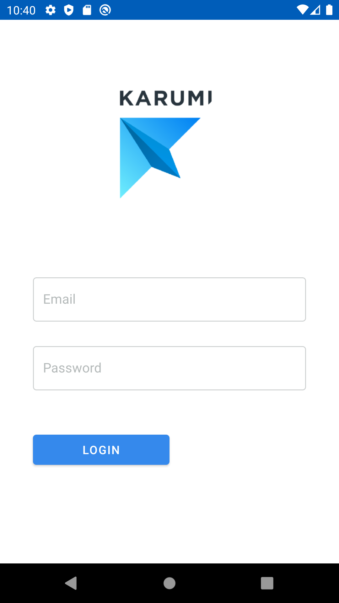
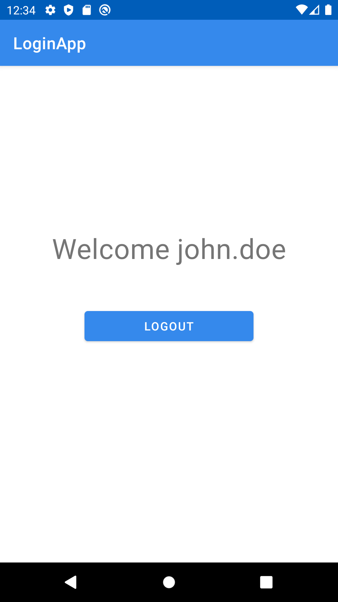
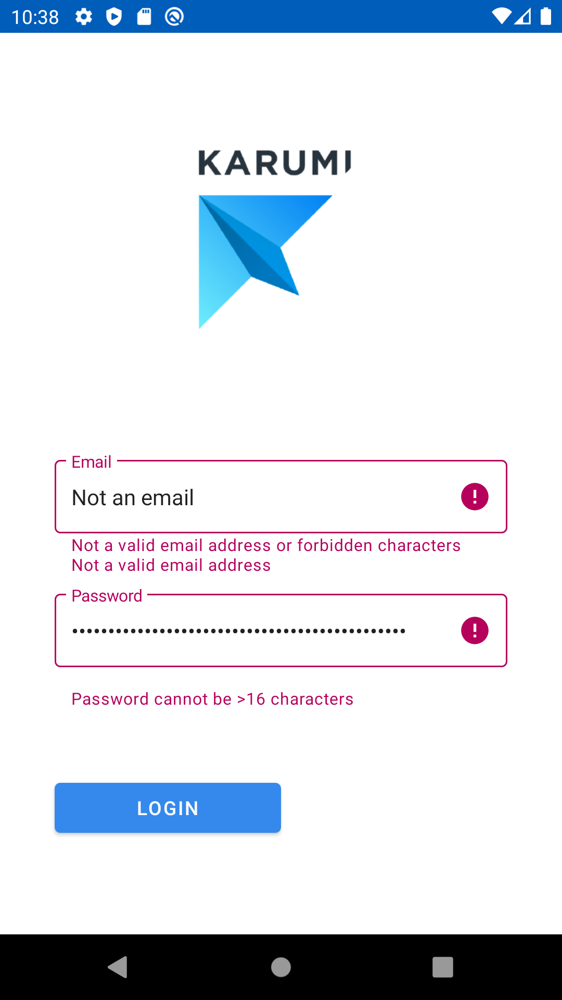
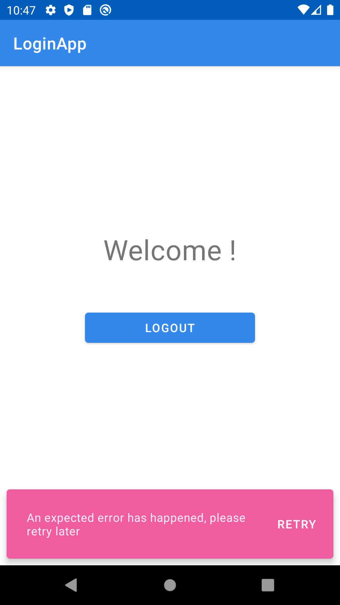
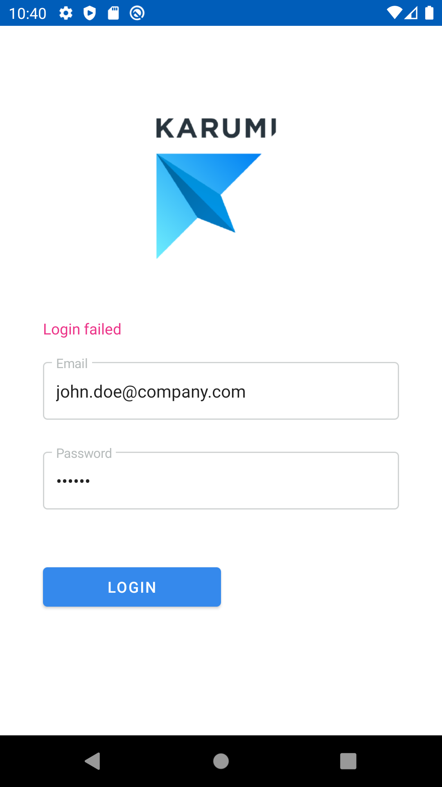
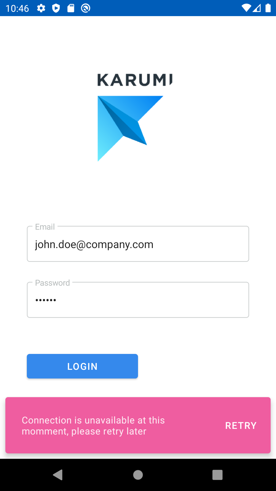

# LoginApp

[](LICENSE)
[](https://ktlint.github.io/)
[](https://github.com/Ikarimeister/LoginApp/actions)
[](https://github.com/Ikarimeister/LoginApp/actions)

Simple login

Table of contents
=================

<!--ts-->
   * [Getting Started](#getting-started)
      * [Data Layer](#data-layer)
      * [Domain Layer](#domain-layer)
      * [Presentation Layer](#presentation-layer)
      * [UI Layer](#ui-layer)
   * [CI](#ci)
<!--te-->
 

## Getting Started 
[(Top)](#loginapp)

This repository contains an Android application that allows user to perform a log in and log out. The login will be persisted, so the user won't have to type their credentials every time the app will open.

Here you have some screenshots of the app:

         
         

### Data Layer
[(Top)](#loginapp)

Since the API is not ready a Fake implementation of the API client will be provided. As the contract of the API is already defined, We will implement also a Real **ApiClient**, using retrofit, that will be tested using **HttpStubbing** with `MockWebServer`.
Request:
```json
{
  "username": "john.doe@company.com",
  "password": "123456"
}
```
Response:
```json
{
  "token": "eyJhbGciOiJIUzI1NiIsInR5cCI6IkpXVCJ9."
}
```
The local storage for the login information is implemented using a **Repository** pattern. With the requirements we already have, the data source we will use will be Android Shared Preferences since is a simple solution, but in the future could be replaced by a database implementation, to make this change easier we will use Repository pattern, to abstract the business logic from the real data source and allow to replace data source implementation fast and smooth.
Since the data source is implemented with `Shared Preferences` over Android SDK, instrumentation tests will be required to test its correct working. 

### Domain Layer
[(Top)](#loginapp)

For the **domain layer**, **Command** pattern has been used as use cases. They are responsible to execute all business logic. Login use case has his own hierarchy error like this:

```kotlin
Either<LoginError, Token>

sealed class LoginError

object NoConection : LoginError()
object IncorrectCredentials : LoginError()
```

The error hierarchy for checkin if user is already logged is:

```kotlin
Either<StorageError, Token>

sealed class StorageError
object TokenNotFound : StorageError()
data class UnknownStorageError(val t: Throwable) : StorageError()
```

### Presentation Layer
[(Top)](#loginapp)

For the threading problem, `kotlinx.Coroutines` are the solution chosen as **Interactors** since they are a fancy and most common way to implement the Interactors nowadays.

For the presentation layer, **MVP** pattern is the chosen implementation because is the most familiar implementation for the development team, we could consider moving to **MVVM** with data binding, but our expertise and confidence with MVP make us feel more comfortable.

Views are stored as WeakReferences to avoid retain its instance and provoke a memory leak. A `by weak`delegate has been added. Full credits to [this repo](https://github.com/Karumi/KataScreenshotKotlin)

```kotlin
fun <T> weak(value: T) = WeakRef(value)

class WeakRef<out T>(value: T) {
    private val weakReference: WeakReference<T> = WeakReference(value)
    operator fun getValue(thisRef: Any, property: KProperty<*>): T? = weakReference.get()
}

private val view by weak(view)
```
                                                                                                                                                        
User validation has been implemented by using `ValidatedNel` applicative from `Arrow` library. The validation process will be accumulative and will showall errors found.

Rules that have been implemented are:
* Email length less than 256 characters,
* Email should contain '@'
* Email should match a pattern.
* Password length greater or equals than 4 characters
* Password length less than 16 characters.

To add more rules just add an extra function on the corresponding type to validate like this: 

```kotlin
fun validate() =
            Validated.applicative(NonEmptyList.semigroup<ValidationErrors>()).mapN(
                    this.validate(NotAnEmail) { this.value.contains("@") },
                    this.validate(TooLongEmail) { this.value.length < maxLength },
                    this.validate(NotValidCharsInEmail) { this.value.matches(EMAIL_REGEX.toRegex()) }
            )
```
The first function parameter should be an error in the hierarchy. The second parameter is a lambda with the condition to satisfy. 

The validation error hierarchy is:
```kotlin
sealed class ValidationErrors

sealed class EmailValidationErrors : ValidationErrors()
sealed class PasswordValidationErrors : ValidationErrors()

object TooShortPassword : PasswordValidationErrors()
object TooLongPassword : PasswordValidationErrors()
object NotAnEmail : EmailValidationErrors()
object NotValidCharsInEmail : EmailValidationErrors()
object TooLongEmail : EmailValidationErrors()
```

### UI Layer
[(Top)](#loginapp)

UI is implemented by Activities extending the correspondent **View** to fulfill **MVP** pattern. The UI is tested by `espresso` with the syntactic sugar of `barista`.
It's intending to test UI with **ScreenShot Testing** also by using `shot`.

For navigation, a function on the companion object of each activity has been added, who is the responsible to handle navegation:
```kotlin
companion object {
        fun navigate(activity: Activity) {
            activity.startActivity(Intent(activity, MainActivity::class.java))
        }
    }
```
Styles and theming has been defined following `Material Design` design system. For further information check [Material Design Page](https://material.io/)

`leak canary has been added to the UI Tests, from now UI will fail if a memory leak is detected.


### Dependency supplying
[(Top)](#loginapp)

`Koin` has been used as a Dependency provider, thought `Koin` is not a **DI framework**, it fits well with providing the needs of this project by now as Service Locator. If the project scales to much migrating to real DI frameworks like `Kodein` or `Dagger` would be recommended but `Koin simplicity benefits are enough to use it at this time.

## CI 
[(Top)](#loginapp)

Several CI checks are set up yo guarantee code style and code quality standards are fulfilled.

* **_Android Checkstyle and Unit Test_**: this GitHub Action will check the code style on every push and pull request by using `ktlint` and `detekt`. It also run Unit tests. The report can be found as an artifact for this action.
* **_Android CI_**: this GitHub Action will assemble the debug binaries on every pull request. Those binaries can be found as binaries artifact on the action.
* **_labeler_**: GitHub Action to check on pull request, the size of the pull request categorizing them in sizes according to the number of lines modified. It will fail if the pull request has more than 1000 lines modified.
* **_Android Test_**: TravisCI will be used on pull requests to run heavier tests, like UI tests, to not delay checks on pushes.


